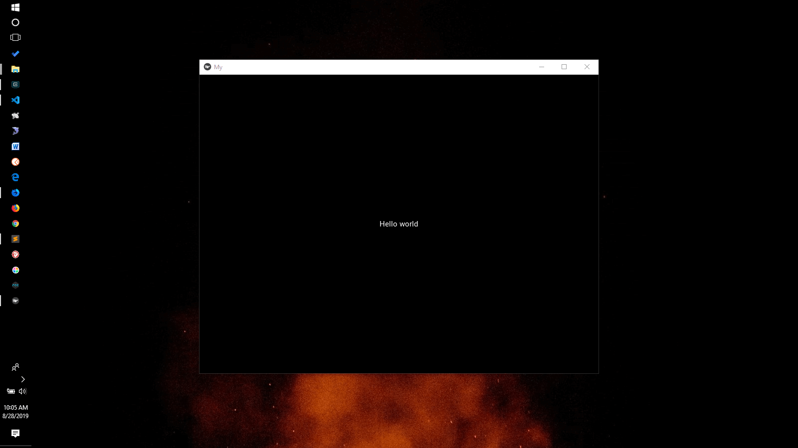

# :book: kivy-hello-world



# Getting Started

Create virtual environment.

```bash
virtualenv env
```

Install all dependencies in `requirements.txt`.

```bash
pip install -r requirements.txt
```

# :exclamation: Issues Encountered

### Module error: ImportError: DLL load failed

#### Fix [How can I bypass kivy module error: ImportError: DLL load failed: The specified module could not be found?](https://stackoverflow.com/questions/34943224/how-can-i-bypass-kivy-module-error-importerror-dll-load-failed-the-specified)

```bash
pip install docutils pygments pypiwin32 kivy.deps.sdl2 kivy.deps.glew
```
